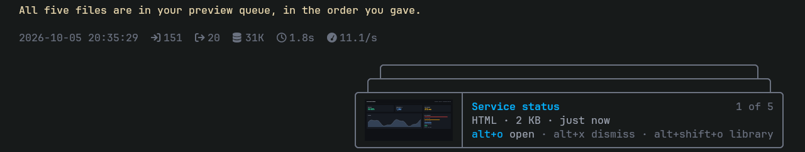
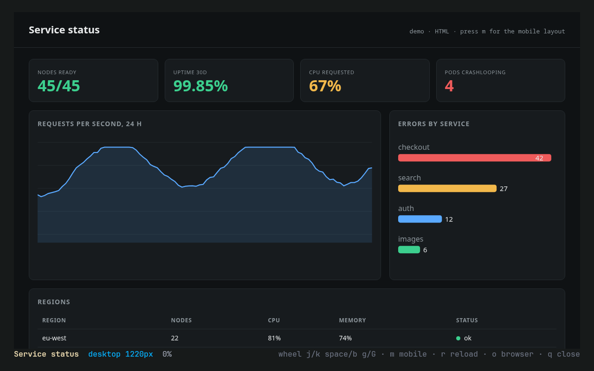
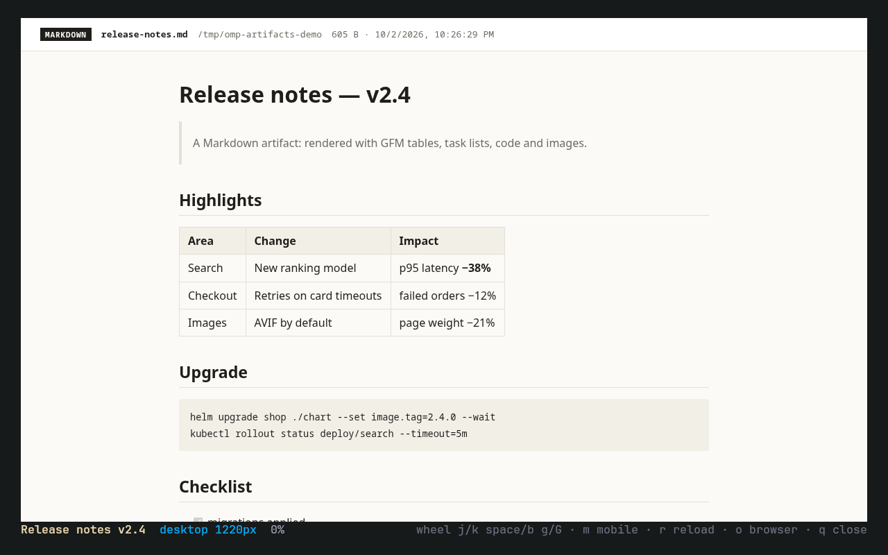
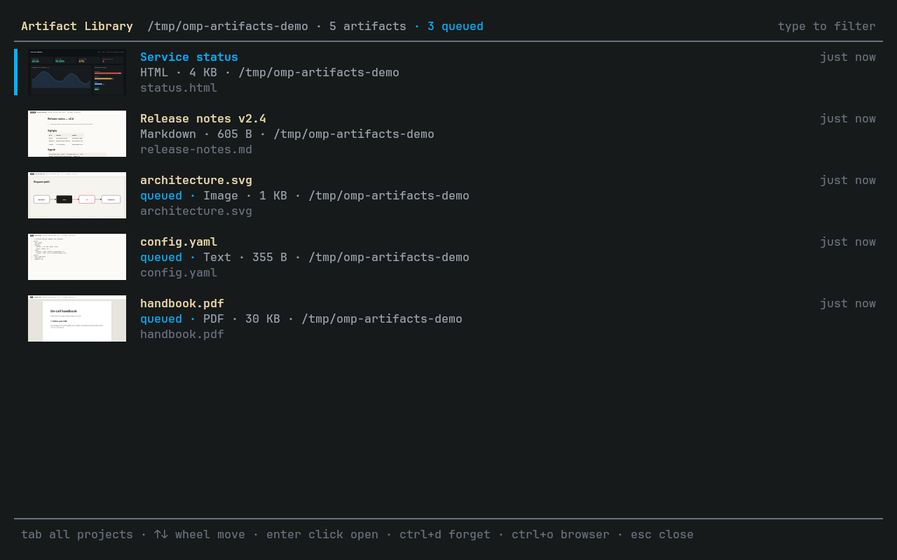

# omp-artifacts

[](https://www.npmjs.com/package/omp-artifacts)
[](https://github.com/Petyok/omp-artifacts)

Artifacts inside [oh-my-pi](https://github.com/can1357/oh-my-pi) (`omp`). The agent hands you a report, a
plan or a mockup; a card appears above the prompt; you read it right in the terminal, scrolling with the
mouse wheel. Everything you were shown stays in a searchable library.



- **Preview queue.** The agent calls `show_artifact`. A card with a thumbnail shows the newest item;
  more items stack behind it (`1 of 5`). `alt+o`, or a click on the card title, opens it; `alt+x`
  dismisses it unopened.
- **Viewer.** A full-screen, scrollable render of the page, made by omp's own headless Chromium and drawn with
  kitty graphics. `m` switches to a 390 px phone layout.
- **Artifact Library.** `alt+shift+o` lists everything shown or viewed in this project, with
  thumbnails, type-to-filter and the queued items tagged; `Tab` switches to all projects.
- **Formats.** HTML, Markdown, plain text and code, images, PDF, and http(s) URLs.



## Install

```sh
omp install omp-artifacts
```

Restart omp. Requirements:

| | |
|---|---|
| omp | built and tested on 18.3.1 |
| Terminal | [kitty](https://sw.kovidgoyal.net/kitty/) (tested on 0.48); needs its graphics protocol with Unicode placeholders. Ghostty supports the same protocol but is untested |
| Browser | none of its own: pages render in the headless Chromium omp already runs for its `browser` tool |
| PDF | `pdftoppm` from poppler (only for PDFs) |
| OS | Linux. macOS should work but is untested |

### Clicking the card

The card title is a terminal hyperlink to `omp-artifacts://open`. To make a click open it, tell kitty to
press the shortcut when such a link is clicked. Add to `~/.config/kitty/open-actions.conf`:

```conf
protocol omp-artifacts
action send_key alt+o
```

Without it, everything works from the keyboard.

## Use

Ask the agent to show you something, or let it decide: the `show_artifact` tool is always available
to it and tells it to point you at the queue instead of describing how to open a file.

| Key or command | What it does |
|---|---|
| `alt+o`, click on the card title | open the newest queued artifact; closing the viewer removes it from the queue |
| `alt+x` | dismiss the newest queued artifact without opening it; it stays in the library |
| `alt+shift+o`, `/artifacts` | open the Artifact Library |
| `/view <file or URL>` | view any file; paths are relative to the session folder, `~` works |
| `/view` | the newest queued artifact, else the last `.html`/`.md` the agent wrote |

In the viewer:

| Keys | |
|---|---|
| mouse wheel, `j` `k`, `↓` `↑` | scroll |
| `space` `b`, `PgDn` `PgUp` | page down / up |
| `g` `G` | top / bottom |
| `m` | desktop or 390 px mobile layout |
| `r` | reload from disk |
| `o` | open in your normal browser |
| `q`, `Esc` | close |

In the library: `Tab` switches between this project and all projects, type to filter (try `queued`, or a
project folder), `↑` `↓` or the wheel to move, `Enter` or a click to open, `ctrl+d` (or `Del`) to forget an
entry (the file stays), `ctrl+o` to open in the browser, `Esc` to close.



### Formats

| Type | How it is shown |
|---|---|
| HTML, URLs | as they are |
| Markdown | GFM through Bun's built-in renderer: tables, task lists, code, relative images |
| Text and code | numbered lines in a monospace font, cut at 2 MB; binary files are refused |
| Images | png, jpg, gif, webp, avif, svg, bmp, ico, centred on a checkerboard |
| PDF | the first 60 pages as images, through `pdftoppm` |

Everything but HTML and URLs gets a small header with the file name, folder, size and date.



## How it works

- Pages render in omp's project-shared headless Chromium, the one its `browser` tool uses, at a viewport
  sized to your terminal in pixels. omp starts and stops that browser; the plugin only connects, as soon as
  the agent writes an `.html` or `.md`. Its tabs sit in a browser context of their own that Chromium
  disposes when the connection drops, so a crashed omp leaves no tabs behind.
- The page is captured in screen-tall strips. Each strip is sent to kitty once and drawn through Unicode
  placeholders, where every cell names its own image row, so scrolling only reprints text. At most five
  strips stay in kitty's memory.
- The library is `artifact-library.json` in omp's agent folder (`~/.omp/agent`), shared by all omp
  windows. Each entry remembers the folder its omp session ran in; that folder is "this project", the
  same way omp scopes its sessions. It keeps the 500 most recently shown entries across all projects;
  older ones drop off the list, the files stay. Rendered pages and thumbnails are cached in
  `~/.cache/omp-artifacts`; anything there unused for 30 days is deleted when omp starts and rebuilt
  on the next view.

## Limits

- The viewer shows a picture of the page: links cannot be clicked and text cannot be selected.
  `o` opens the real page in a browser.
- kitty-style graphics only; other terminals get an error message instead of a broken screen.
- The queue lives in memory and is empty after an omp restart; the library keeps everything.
- Mermaid blocks in Markdown are shown as code.

## Develop

```sh
git clone https://github.com/Petyok/omp-artifacts
omp install ./omp-artifacts   # links the checkout; edits apply on the next omp start
bun test
```

## License

MIT
